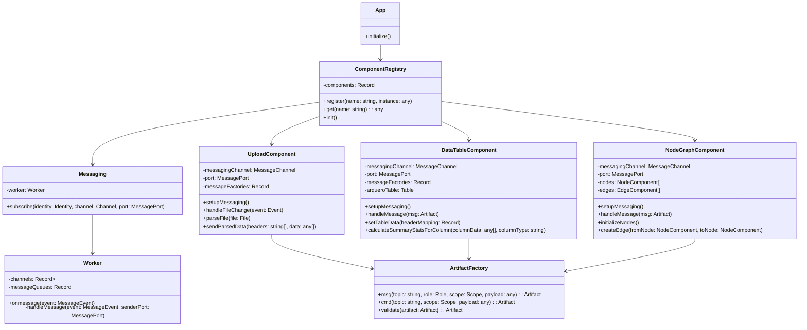
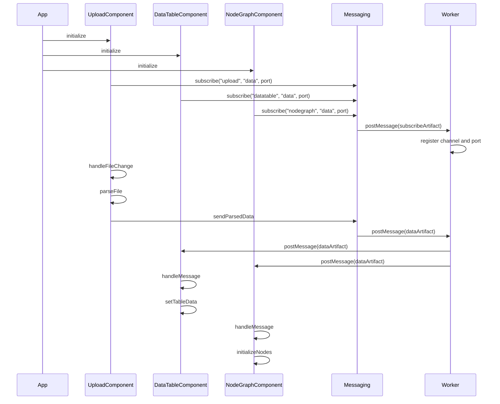
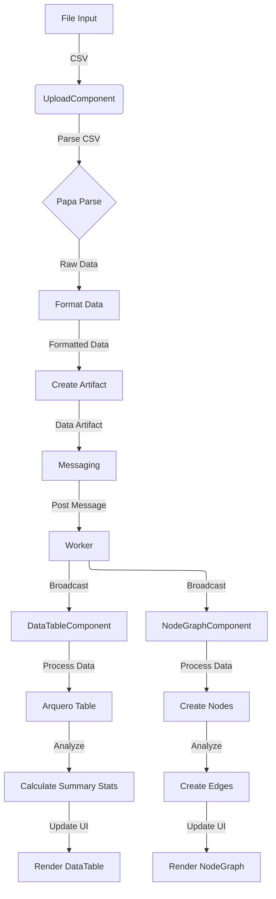
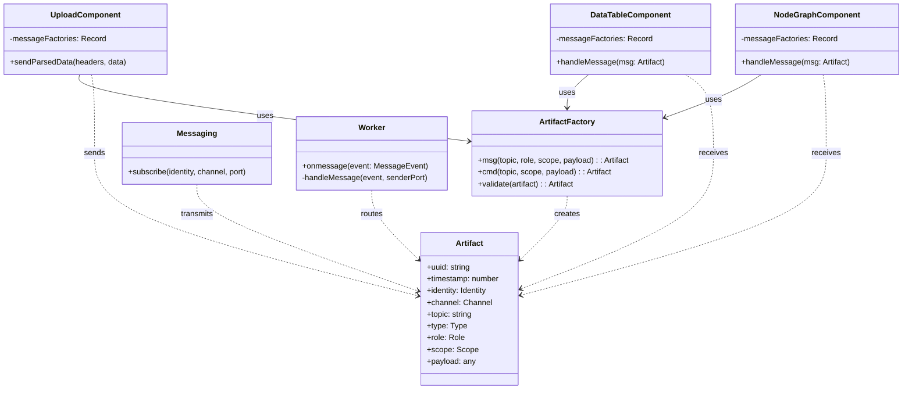

## Architecture

### Component Structure

```mermaid
%%{init: {"flowchart": {"defaultRenderer": "elk"}} }%%
classDiagram
    class App {
        +initialize()
    }
    class ComponentRegistry {
        -components: Record<string, any>
        +register(name: string, instance: any)
        +get(name: string): any
        +init()
    }
    class Messaging {
        -worker: Worker
        +subscribe(identity: Identity, channel: Channel, port: MessagePort)
    }
    class UploadComponent {
        -messagingChannel: MessageChannel
        -port: MessagePort
        -messageFactories: Record<string, ArtifactFactory>
        +setupMessaging()
        +handleFileChange(event: Event)
        +parseFile(file: File)
        +sendParsedData(headers: string[], data: any[])
    }
    class DataTableComponent {
        -messagingChannel: MessageChannel
        -port: MessagePort
        -messageFactories: Record<string, ArtifactFactory>
        -arqueroTable: Table
        +setupMessaging()
        +handleMessage(msg: Artifact)
        +setTableData(headerMapping: Record<string, string>)
        +calculateSummaryStatsForColumn(columnData: any[], columnType: string)
    }
    class NodeGraphComponent {
        -messagingChannel: MessageChannel
        -port: MessagePort
        -nodes: NodeComponent[]
        -edges: EdgeComponent[]
        +setupMessaging()
        +handleMessage(msg: Artifact)
        +initializeNodes()
        +createEdge(fromNode: NodeComponent, toNode: NodeComponent)
    }
    class ArtifactFactory {
        +msg(topic: string, role: Role, scope: Scope, payload: any): Artifact
        +cmd(topic: string, scope: Scope, payload: any): Artifact
        +validate(artifact: Artifact): Artifact
    }
    class Worker {
        -channels: Record<string, Set<MessagePort>>
        -messageQueues: Record<string, Artifact[]>
        +onmessage(event: MessageEvent)
        -handleMessage(event: MessageEvent, senderPort: MessagePort)
    }

    App --> ComponentRegistry
    ComponentRegistry --> Messaging
    ComponentRegistry --> UploadComponent
    ComponentRegistry --> DataTableComponent
    ComponentRegistry --> NodeGraphComponent
    UploadComponent --> ArtifactFactory
    DataTableComponent --> ArtifactFactory
    NodeGraphComponent --> ArtifactFactory
    Messaging --> Worker
```

### Messaging Flow

```mermaid
%%{init: {"flowchart": {"defaultRenderer": "elk"}} }%%
sequenceDiagram
    participant App
    participant UploadComponent
    participant DataTableComponent
    participant NodeGraphComponent
    participant Messaging
    participant Worker

    App->>UploadComponent: initialize
    App->>DataTableComponent: initialize
    App->>NodeGraphComponent: initialize
    UploadComponent->>Messaging: subscribe("upload", "data", port)
    DataTableComponent->>Messaging: subscribe("datatable", "data", port)
    NodeGraphComponent->>Messaging: subscribe("nodegraph", "data", port)
    Messaging->>Worker: postMessage(subscribeArtifact)
    Worker->>Worker: register channel and port
    UploadComponent->>UploadComponent: handleFileChange
    UploadComponent->>UploadComponent: parseFile
    UploadComponent->>Messaging: sendParsedData
    Messaging->>Worker: postMessage(dataArtifact)
    Worker->>DataTableComponent: postMessage(dataArtifact)
    Worker->>NodeGraphComponent: postMessage(dataArtifact)
    DataTableComponent->>DataTableComponent: handleMessage
    DataTableComponent->>DataTableComponent: setTableData
    NodeGraphComponent->>NodeGraphComponent: handleMessage
    NodeGraphComponent->>NodeGraphComponent: initializeNodes
```

### Data Processing Pipeline

```mermaid
%%{init: {"flowchart": {"defaultRenderer": "elk"}} }%%
graph TD
    A[File Input] -->|CSV| B(UploadComponent)
    B -->|Parse CSV| C{Papa Parse}
    C -->|Raw Data| D[Format Data]
    D -->|Formatted Data| E[Create Artifact]
    E -->|Data Artifact| F[Messaging]
    F -->|Post Message| G[Worker]
    G -->|Broadcast| H[DataTableComponent]
    G -->|Broadcast| I[NodeGraphComponent]
    H -->|Process Data| J[Arquero Table]
    J -->|Analyze| K[Calculate Summary Stats]
    K -->|Update UI| L[Render DataTable]
    I -->|Process Data| M[Create Nodes]
    M -->|Analyze| N[Create Edges]
    N -->|Update UI| O[Render NodeGraph]
```

### Artifact Structure and Flow

```mermaid
%%{init: {"flowchart": {"defaultRenderer": "elk"}} }%%
classDiagram
    class Artifact {
        +uuid: string
        +timestamp: number
        +identity: Identity
        +channel: Channel
        +topic: string
        +type: Type
        +role: Role
        +scope: Scope
        +payload: any
    }
    class ArtifactFactory {
        +msg(topic, role, scope, payload): Artifact
        +cmd(topic, scope, payload): Artifact
        +validate(artifact): Artifact
    }
    class UploadComponent {
        -messageFactories: Record<string, ArtifactFactory>
        +sendParsedData(headers, data)
    }
    class DataTableComponent {
        -messageFactories: Record<string, ArtifactFactory>
        +handleMessage(msg: Artifact)
    }
    class NodeGraphComponent {
        -messageFactories: Record<string, ArtifactFactory>
        +handleMessage(msg: Artifact)
    }
    class Messaging {
        +subscribe(identity, channel, port)
    }
    class Worker {
        +onmessage(event: MessageEvent)
        -handleMessage(event, senderPort)
    }

    ArtifactFactory ..> Artifact : creates
    UploadComponent --> ArtifactFactory : uses
    DataTableComponent --> ArtifactFactory : uses
    NodeGraphComponent --> ArtifactFactory : uses
    UploadComponent ..> Artifact : sends
    DataTableComponent ..> Artifact : receives
    NodeGraphComponent ..> Artifact : receives
    Messaging ..> Artifact : transmits
    Worker ..> Artifact : routes
```